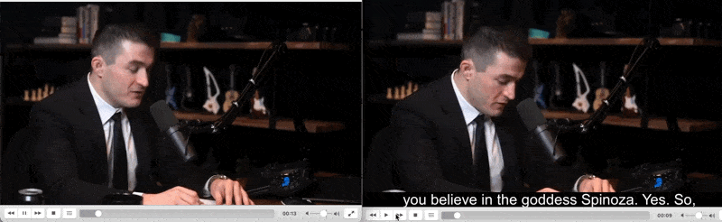

# YouTube-Speech-to-text-to-subtitle
 create video with subtitle from youtube video

## How it works
1. download youtube video from a url

2. create srt file from video using deepgram speech to text

3. use moivepy to combine original video and srt file to create video with subtitle

